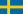
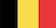
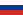

# Nobel Prizes in Physics

Based on the statistics of all the Nobel Prize winners in physics over the years, I have come to the top 10 organizations and birth countries that have won the most Nobel Prizes in Physicists, they are:

## Affiliation at the time of the award (TOP 10)

| Organization                                | Country        | Number of Nobel Prizes |
| ------------------------------------------- | -------------- | ---------------------- |
| California Institute of Technology          | USA            | 9                      |
| Princeton University                        | USA            | 9                      |
| Stanford University                         | USA            | 9                      |
| Harvard University                          | USA            | 9                      |
| University of Cambridge                     | United Kingdom | 8                      |
| University of California, Berkeley          | USA            | 8                      |
| Massachusetts Institute of Technology (MIT) | USA            | 8                      |
| P.N. Lebedev Physical Institute             | Russia         | 6                      |
| University of Chicago                       | USA            | 5                      |
| Bell Laboratories                           | USA            | 5                      |

## Country of birth (TOP 10)

| Country        | Number of Nobel Prizes |
| -------------- | ---------------------- |
| USA            | 72                     |
| Germany        | 28                     |
| United Kingdom | 23                     |
| Japan          | 12                     |
| France         | 11                     |
| Russia         | 10                     |
| Netherlands    | 9                      |
| Poland         | 8                      |
| Italy          | 6                      |
| Switzerland    | 6                      |

# Former Nobel Prize Physicists

The Nobel Prize in Physics has been awarded 116 times to 222 Nobel Prize laureates between 1901 and 2022. John Bardeen is the only laureate who has been awarded the Nobel Prize in Physics twice, in 1956 and 1972. This means that a total of 221 individuals have received the Nobel Prize in Physics.

https://www.nobelprize.org/prizes/lists/all-nobel-prizes-in-physics

## **2023**
>  **for experimental methods that generate attosecond pulses of light for the study of electron dynamics in matter**

   - [Pierre Agostini](https://www.nobelprize.org/prizes/physics/2023/agostini/facts/)  (b. 1941-07-23)   **USA**

   - [Ferenc Krausz](https://www.nobelprize.org/prizes/physics/2023/krausz/facts/)  (b. 1962-05-17) .svg.png)  **Germany**
   
   - [Anne L'Huillier](https://www.nobelprize.org/prizes/physics/2023/lhuillier/facts/)  (b. 1958-08-16)   **Sweden**
   

## **2022**
>  **for experiments with entangled photons, establishing the violation of Bell inequalities and pioneering quantum information science**

   - [Alain Aspect](https://www.nobelprize.org/prizes/physics/2022/aspect/facts/)  (b. 1947-06-15)   **France** 
   
   - [John F. Clauser](https://www.nobelprize.org/prizes/physics/2022/clauser/facts/)  (b. 1942-12-01)   **United States**
   
   - [Anton Zeilinger](https://www.nobelprize.org/prizes/physics/2022/zeilinger/facts/)  (b. 1945-05-20)   **Austria**

## **2021**
>  **for the physical modelling of Earth’s climate, quantifying variability and reliably predicting global warming**

   - [Syukuro Manabe](https://www.nobelprize.org/prizes/physics/2021/manabe/facts/)  (b. 1931-09-21)   **Japan**
	
   - [Klaus Hasselmann](https://www.nobelprize.org/prizes/physics/2021/hasselmann/facts/)  (b. 1931-10-25) .svg.png)  **Germany**

>  **for the discovery of the interplay of disorder and fluctuations in physical systems from atomic to planetary scales**

   - [Giorgio Parisi](https://www.nobelprize.org/prizes/physics/2021/parisi/facts/)  (b. 1948-08-04)   **Italy**

## **2020**
> **for the discovery that black hole formation is a robust prediction of the general theory of relativity**

   - [Roger Penrose](https://www.nobelprize.org/prizes/physics/2020/penrose/facts/)  (b. 1931-08-08)   **UK**
	
> **for the discovery of a supermassive compact object at the centre of our galaxy**

   - [Reinhard Genzel](https://www.nobelprize.org/prizes/physics/2020/genzel/facts/) （b. 1952-03-24) .svg.png)  **Germany**
  
   - [Andrea Ghez](https://www.nobelprize.org/prizes/physics/2020/ghez/facts/)  （b. 1965-06-16）  **USA**
  

## **2019**

> **for theoretical discoveries in physical cosmology**
	
   - [James Peebles](https://www.nobelprize.org/prizes/physics/2019/peebles/facts/) (b. 1935-04-25) .svg.png)  **Canada**

> **for the discovery of an exoplanet orbiting a solar-type star**  

   - [Michel Mayor](https://www.nobelprize.org/prizes/physics/2019/mayor/facts/) (b. 1942-01-12) .svg.png)  **Switzerland**
  
   - [Didier Queloz](https://www.nobelprize.org/prizes/physics/2019/queloz/facts/)  (b. 1966-02-23) .svg.png)  **Switzerland**
  
## **2018**

> **for the optical tweezers and their application to biological systems**
   - [Arthur Ashkin](https://www.nobelprize.org/prizes/physics/2018/ashkin/facts/) (b. 1922-09-02)   **USA**

> **for their method of generating high-intensity, ultra-short optical pulses**

   - [Gérard Mourou](https://www.nobelprize.org/prizes/physics/2018/mourou/facts/) (b.1944-06-22)   **France** 
   - [Donna Strickland](https://www.nobelprize.org/prizes/physics/2018/strickland/facts/) (b.1959-05-27)  .svg.png)  **Canada**

## **2017**

> **for decisive contributions to the LIGO detector and the observation of gravitational waves**

   - [Rainer Weiss](https://www.nobelprize.org/prizes/physics/2017/weiss/facts/) (b.1932-09-29)  .svg.png) **Germany**
  
   - [Barry C. Barish](https://www.nobelprize.org/prizes/physics/2017/barish/facts/) (b.1936-01-27)   **USA**
	
   - [Kip S. Thorne](https://www.nobelprize.org/prizes/physics/2017/thorne/facts/) (b.1940-06-01)   **USA**

## **2016**

> **for theoretical discoveries of topological phase transitions and topological phases of matter**

   - [David J. Thouless](https://www.nobelprize.org/prizes/physics/2016/thouless/facts/) (b.1934-09-21)   **USA**
	
   - [F. Duncan M. Haldane](https://www.nobelprize.org/prizes/physics/2016/haldane/facts/) (b.1951-09-14)   **USA**
	
   - [J. Michael Kosterlitz](https://www.nobelprize.org/prizes/physics/2016/kosterlitz/facts/) (b.1943-06-22)   **USA**
	

## **2015**

> **for the discovery of neutrino oscillations, which shows that neutrinos have mass**

   - [Takaaki Kajita](https://www.nobelprize.org/prizes/physics/2015/kajita/facts/) (b.1959-03-09)   **Japan**

   - [Arthur B. McDonald](https://www.nobelprize.org/prizes/physics/2015/mcdonald/facts/) (b.1943-08-29)  .svg.png)  **Canada**

## **2014**

> **for the invention of efficient blue light-emitting diodes which has enabled bright and energy-saving white light sources**

   - [Isamu Akasaki](https://www.nobelprize.org/prizes/physics/2014/akasaki/facts/) (b.1929-01-30)   **Japan**

   - [Hiroshi Amano](https://www.nobelprize.org/prizes/physics/2014/amano/facts/) (b.1960-09-11)   **Japan**

   - [Shuji Nakamura](https://www.nobelprize.org/prizes/physics/2014/nakamura/facts/) (b.1954-05-22)   **USA**

## **2013**
> **for the theoretical discovery of a mechanism that contributes to our understanding of the origin of mass of subatomic particles, and which recently was confirmed through the discovery of the predicted fundamental particle, by the ATLAS and CMS experiments at CERN's Large Hadron Collider**

   - [François Englert](https://www.nobelprize.org/prizes/physics/2013/englert/facts/) (b.1932-11-06)   **Belgium**
  
   - [Peter W. Higgs](https://www.nobelprize.org/prizes/physics/2013/higgs/facts/) (b.1929-05-29)   **UK**

## **2012**

>**for ground-breaking experimental methods that enable measuring and manipulation of individual quantum systems**

   - [Serge Haroche](https://www.nobelprize.org/prizes/physics/2012/haroche/facts/) (b.1944-09-11)   **France** 

   - [David J. Wineland](https://www.nobelprize.org/prizes/physics/2012/wineland/facts/) (b.1944-02-24)   **USA**

## **2011**

> **for the discovery of the accelerating expansion of the Universe through observations of distant supernovae**

   - [Saul Perlmutter](https://www.nobelprize.org/prizes/physics/2011/perlmutter/facts/) (b.1959-01-01)   **USA**

   - [Brian P. Schmidt](https://www.nobelprize.org/prizes/physics/2011/schmidt/facts/) (b.1967-02-24)   **Austria**

   -  [Adam G. Riess](https://www.nobelprize.org/prizes/physics/2011/riess/facts/) (b.1969-12-16)    **USA**

## **2010**

> **for groundbreaking experiments regarding the two-dimensional material graphene**

- [Andre Geim](https://www.nobelprize.org/prizes/physics/2010/geim/facts/) (b.1958-10-21)  **Russia**

- [Konstantin Novoselov](https://www.nobelprize.org/prizes/physics/2010/novoselov/facts/) (b.1974-08-23)  **Russia**

## **2009**

> **for groundbreaking achievements concerning the transmission of light in fibers for optical communication**

- [Charles K. Kao](https://www.nobelprize.org/prizes/physics/2009/kao/facts/) (b.1933-11-04, d.2018-09-23)  **Japan**

> **for the invention of an imaging semiconductor circuit - the CCD sensor**

- [Willard S. Boyle](https://www.nobelprize.org/prizes/physics/2009/boyle/facts/) (b.1924-08-19, d.2011-05-07) .svg.png) **Canada**

- [George E. Smith](https://www.nobelprize.org/prizes/physics/2009/smith/facts/) (b.1930-05-10)  **USA**

## **2008**

> **for the discovery of the mechanism of spontaneous broken symmetry in subatomic physics**

- [Yoichiro Nambu](https://www.nobelprize.org/prizes/physics/2008/nambu/facts/) (b.1921-01-18, d.2015-07-05)  **Japan**

> **for the discovery of the origin of the broken symmetry which predicts the existence of at least three families of quarks in nature**

- [Makoto Kobayashi](https://www.nobelprize.org/prizes/physics/2008/kobayashi/facts/) (b.1944-04-07)  **Japan**

- [Toshihide Maskawa](https://www.nobelprize.org/prizes/physics/2008/maskawa/facts/) (b.1940-02-07, d.2021-07-23)  **Japan**

## **2007**

> **for the discovery of Giant Magnetoresistance**

- [Albert Fert](https://www.nobelprize.org/prizes/physics/2007/fert/facts/) (b.1938-03-07)  **France**

- [Peter Grünberg](https://www.nobelprize.org/prizes/physics/2007/grunberg/facts/) (b.1939-05-18, d.2018-04-07) .svg.png) **Germany**

## **2006**

> **for their discovery of the blackbody form and anisotropy of the cosmic microwave background radiation**

- [John C. Mather](https://www.nobelprize.org/prizes/physics/2006/mather/facts/) (b.1946-08-07)  **USA**

- [George F. Smoot](https://www.nobelprize.org/prizes/physics/2006/smoot/facts/) (b.1945-02-20)  **USA**

## **2005**

> **for his contribution to the quantum theory of optical coherence**

- [Roy J. Glauber](https://www.nobelprize.org/prizes/physics/2005/glauber/facts/) (b.1925-09-01, d.2018-12-26)  **USA**

> **for their contributions to the development of laser-based precision spectroscopy, including the optical frequency comb technique**

- [John L. Hall](https://www.nobelprize.org/prizes/physics/2005/hall/facts/) (b.1934-08-21)  **USA**

- [Theodor W. Hänsch](https://www.nobelprize.org/prizes/physics/2005/hansch/facts/) (b.1941-10-30) .svg.png) **Germany**

## **2004**

> **for the discovery of asymptotic freedom in the theory of the strong interaction**

- [David J. Gross](https://www.nobelprize.org/prizes/physics/2004/gross/facts/) (b.1941-02-19)  **USA**

- [H. David Politzer](https://www.nobelprize.org/prizes/physics/2004/politzer/facts/) (b.1949-08-31)  **USA**

- [Frank Wilczek](https://www.nobelprize.org/prizes/physics/2004/wilczek/facts/) (b.1951-05-15)  **USA**

## **2003**

>　**for pioneering contributions to the theory of superconductors and superfluids**

- [Alexei Abrikosov](https://www.nobelprize.org/prizes/physics/2003/abrikosov/facts/) (b.1928-06-25, d.2017-03-29)  **Russia**

- [Vitaly L. Ginzburg](https://www.nobelprize.org/prizes/physics/2003/ginzburg/facts/) (b.1916-10-04, d.2009-11-08)  **Russia**

- [Anthony J. Leggett](https://www.nobelprize.org/prizes/physics/2003/leggett/facts/) (b.1938-03-26)   **UK**

## **2002**

> **for pioneering contributions to astrophysics, in particular for the detection of cosmic neutrinos**

- [Raymond Davis Jr.](https://www.nobelprize.org/prizes/physics/2002/davis/facts/) (b.1914-10-14, d.2006-05-31)  **USA**

- [Masatoshi Koshiba](https://www.nobelprize.org/prizes/physics/2002/koshiba/facts/) (b.1926-09-19, d.2020-11-12)  **Japan**

> **for pioneering contributions to astrophysics, which have led to the discovery of cosmic X-ray sources**

- [Riccardo Giacconi](https://www.nobelprize.org/prizes/physics/2002/giacconi/facts/) (b.1931-10-06, d.2018-12-16)  **USA** & .svg.png) **Italy**

## **2001**

> **for the achievement of Bose-Einstein condensation in dilute gases of alkali atoms, and for early fundamental studies of the properties of the condensates**

- [Eric Cornell](https://www.nobelprize.org/prizes/physics/2001/cornell/facts/) (b.1961-12-19)  **USA**

- [Wolfgang Ketterle](https://www.nobelprize.org/prizes/physics/2001/ketterle/facts/) (b.1957-10-21)  .svg.png) **Germany**

- [Carl Wieman](https://www.nobelprize.org/prizes/physics/2001/wieman/facts/) (b.1951-03-26)  **USA**

## **2000**

> **for developing semiconductor heterostructures used in high-speed- and opto-electronics**

- [Zhores Alferov](https://www.nobelprize.org/prizes/physics/2000/alferov/facts/) (b.1930-03-15, d.2019-03-01)  **Russia**

- [Herbert Kroemer](https://www.nobelprize.org/prizes/physics/2000/kroemer/facts/) (b.1928-08-25, d.2024-03-08)  **USA** & .svg.png) **Germany**

> **for his part in the invention of the integrated circuit**

- [Jack Kilby](https://www.nobelprize.org/prizes/physics/2000/kilby/facts/) (b.1923-11-08, d.2005-06-20)  **USA**

## **1999**

......